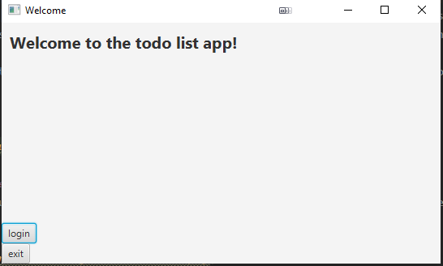
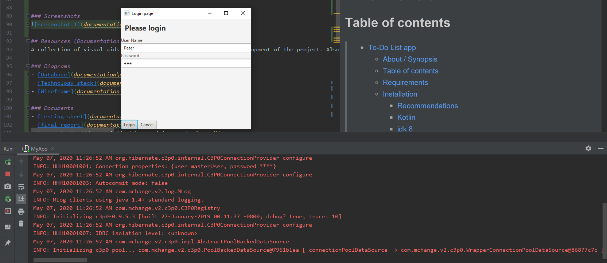
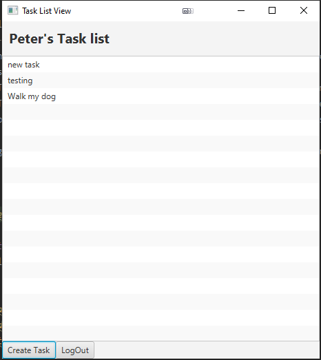
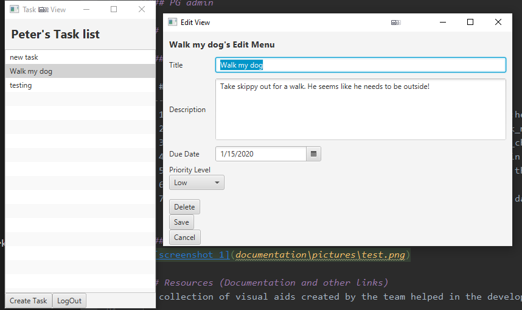

# To-Do List app

## About / Synopsis
This project will be a simple 'todo' list app. A user can add ideas/projects into the system with priority levels and due dates to be tracked. The database portion of this app will be hosted on Amazon Web Service(AWS). The GUI portion of this app will be handled by the tornadoFX library.  

* To-Do list app
* Kotlin, TornadoFX, AWS
* Project status: Prototype
* Programming Language Final

## Table of contents

> * [To-Do List app](#To-Do-List-app)
>   * [About / Synopsis](#about--synopsis)
>   * [Table of contents](#table-of-contents)
>   * [Requirements](#Requirements)
>   * [Installation](#installation)
>       * [Recommendations](#Recommendations)
>       * [Kotlin](#Kotlin)
>       * [jdk 8](#jdk-8)
>       * [TornadoFX](#TornadoFX)
>       * [hibernate](#hibernate)
>       * [Maven](#Maven)
>       * [PG admin](#PG-admin)
>   * [Usage](#usage)
>     * [Features](#features)
>     * [Screenshots](#screenshots)
>   * [Resources (Documentation and other links)](#resources-documentation-and-other-links)
>       * [Diagrams](#Diagrams)
>       * [Documents](#Documents)
>       * [Tutorials](#Tutorials)
>   * [Contributing / Reporting issues](#contributing--reporting-issues)
>   * [License](#license)
>   * [Development Team](#development-team)
>   * [Goals](#goals)
>   * [Acknowledgements](#Acknowledgements)

## Requirements
The following are a list of technologies that will be referenced during the development of this software. 

- [Kotlin](https://kotlinlang.org/)
    - The programming language that handles the logic of the app
- [jdk 8](https://www.oracle.com/java/technologies/javase-jdk8-downloads.html)
    - The run time environment that executes the app. **Note:** jdk 8 is needed because the tornado fx library needs java FX which needs jdk 8.
- [TornadoFX](https://tornadofx.io/)
    - The GUI library we use for the GUI.
- [hibernate](https://hibernate.org/)
    - A tool that maps our java class models into models for the DBMS
- [Maven](https://maven.apache.org/)
    - The tool that builds the app and makes sure all the dependencies are there. 
- [PG admin](https://www.pgadmin.org/)
    - This allows you to view the database directly to make sure data is saved/read correctly. 

## Installation

### Recommendations
We suggest using the Windows 10 environment to run/ build this app. We also suggest using the [Intellij IDE](https://www.jetbrains.com/idea/), as it makes dealing with the multiple technologies much easer. 

**Note:** The app has not been tested on older versions of windows or any Unix based system. So we do not guarantee it will work. 

### Kotlin

### jdk 8

### TornadoFX

### hibernate

### Maven

### PG admin

## Usage

### Features

| # | Feature | Details | Status |
|---|-----|:-----:|:------:|
| 1 | Enter Tasks | The system can take in tasks and store them | :heavy_check_mark: |
| 2 | View Tasks | Tasks can be viewed on the system | :heavy_check_mark: |
| 3 | Delete Tasks | Tasks can be deleted from the system | :heavy_check_mark: |
| 4 | Login Portal | To enter in the system, a user must enter login credentials | :heavy_check_mark: |
| 5 | Multiple users on the system | More then one user can access the system and see there own tasks. | :x: |
| 6 | Sorting Tasks | Can sort tasks based on metrics | :x: |
| 7 | Tasks can be tagged by date or priority | Tasks hold tags of date and priority level so they can be sorted | :heavy_check_mark: |
| 8 | Add CSS | Adding some type of css so the program does not look like :poop: | :x: |

### Screenshots
Here are some screenshots of the app running in its current build.

#### Main home screen

#### The login page as its connecting to AWS

#### The users main view of seeing all the tasks tied to them

#### The edit view of a task

## Resources (Documentation and other links)
A collection of visual aids created by the team helped in the development of the project. Also references to any tutorials used during development.

### Diagrams
- [Database](readme_resources/diagrams/database.pdf)
- [Technology stack](readme_resources/diagrams/technology_stack.pdf)
- [Wireframe](readme_resources/diagrams/wireframe.pdf)

### Documents
- [testing sheet](readme_resources/documents/tests.pdf)
- [final report](readme_resources/documents/final_report.pdf)
- [user stories](readme_resources/documents/user_stories.pdf)

### Tutorials
- [TornadoFX](https://edvin.gitbooks.io/tornadofx-guide/)

## Contributing / Reporting issues
For [Contributing](https://github.com/NickJWhite12/task_scheduling_app/pulls), please create a pull request with the title either being 'New Feature' or the title that was used when reporting the issue. The pull request should be with a testing branch and not with 'main'. Any pull requests that merge with main will likely be denied.

For [reporting issues](https://github.com/NickJWhite12/task_scheduling_app/issues), we are using the built-in reporting system that github provides. Any bugs or suggestions to the application should be placed there.

## License
- [Kotlin](https://kotlinlang.org/docs/reference/faq.html)
- [jdk 8](https://www.oracle.com/technetwork/java/javase/overview/oracle-jdk-faqs.html)
- [TornadoFX](https://github.com/edvin/tornadofx/blob/master/LICENSE)
- [hibernate](http://hibernate.org/community/license/)
- [Maven](https://maven.apache.org/ref/3.0.2/license.html)
- [PG admin](https://www.pgadmin.org/licence/)

## Development Team

### We are team badger

#### Peter Keres
* [GitHub Account](https://github.com/peterkeres)
* <keres_peter@columbusstate.edu>

#### Kevin Horadan
- [GitHub Account](https://github.com/khoradan)
- <horadan_kevin@columbusstate.edu>

#### Nicholas White
- [GitHub Account](https://github.com/NickJWhite12)
- <white_nicholas@columbusstate.edu>

## Goals
the goal of this project was simple. Is to gain a better understanding of what the Kotlin programming language can do. This includes acts such as language syntax, technology connectivity, and library support. But along the way we all wanted to focus on areas around development that programmers in school often over look. Like GitHub, GUI development, Testing, And Documentation. 

But most of all, we just wanted to tinker with some code! :fist_right: :desktop_computer: :fist_left:

## Acknowledgements
We wanted to thank our teacher, Dr. Angelopoulou, for giving us the chance to grow as developers because of this project. 
